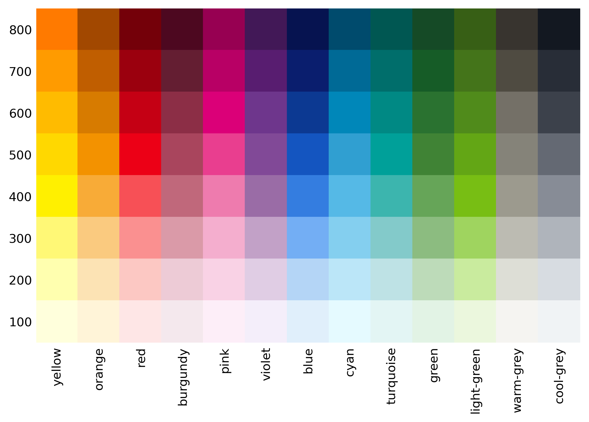

# Deutsche Bahn Markenfarben
Get the html or rgb code of one of the [Deutsche Bahn AG brand colors](https://marketingportal.extranet.deutschebahn.com/marketingportal/Marke-und-Design/Basiselemente/Farbe).

**Application examples** *([full example](https://github.com/jbnsn/dbmarkenfarben?tab=readme-ov-file#example-usage)***):**
```Python
db_colors.get('red')  # Returns '#ec0016'
db_colors.get('red', 200)  # Returns '#fcc8c3'
db_colors.get('red', 200, 'rgb')  # Returns (252, 200, 195)
```



`['blue', 'burgundy', 'cool-grey', 'cyan', 'green', 'light-green', 'orange', 'pink', 'red', 'turquoise', 'violet', 'warm-grey', 'yellow']`

## Install and Update

*dbmarkenfarben* is available via [PyPi](https://pypi.org/project/dbmarkenfarben/).

### Install

```Python
pip install dbmarkenfarben
```

### Update

```Python
pip install --upgrade dbmarkenfarben
```
or
```
pip install -U dbmarkenfarben
```

## Example usage

```Python

import dbmarkenfarben as dbmf

db_colors = dbmf.DeutscheBahnMarkenFarben()

db_colors.print_colors()  # Prints and returns a list of available colors.

db_colors.colors  # Returns a dictionary of available colors.

db_colors.get('red')  # Returns '#ec0016'
db_colors.get('red', 200)  # Returns '#fcc8c3'
db_colors.get('red', 200, 'rgb')  # Returns (252, 200, 195)

```

## `get` function

```Python
get(
    color_name,
    color_saturation=500,
    return_format='html'
    ):
    """
    Get the color code for the given color name.

    Parameters
    ----------
    color_name : str
        Name of the brand color of Deutsche Bahn AG.
        https://marketingportal.extranet.deutschebahn.com/marketingportal/Marke-und-Design/Basiselemente/Farbe
    color_saturation : int, optional
        100, 200, 300, 400, 500, 600, 700 or 800. The default is 500.
    return_format : str, optional
        Whether the html or rgb color code shall be returnd.
        The default is 'html'.

    Raises
    ------
    ValueError
        Invalid return format.

    Returns
    -------
    Color code : str (html) OR tuple (rgb)

    """
```

# A quick and dirty code for the use of all the DB brand colors
```Python
"""A quick and dirty code for the use of all the DB brand colors."""

import pandas as pd


class DeutscheBahnMarkenFarben:
    """Initiate `DeutscheBahnMarkenFarben` class."""

    def __init__(self):
        self.colors = (
            pd.DataFrame(
                {"blue":  ["#E0EFFB", "#B4D5F6", "#73AEF4", "#347DE0",
                           "#1455C0", "#0C3992", "#0A1E6E", "#061350"],
                 "burgundy": ["#F4E8ED", "#EDCBD6", "#DA9AA8", "#C0687B",
                              "#A9455D", "#8C2E46", "#641E32", "#4D0820"],
                 "cool-grey": ["#f0f3f5", "#d7dce1", "#afb4bb", "#878c96",
                               "#646973", "#3c414b", "#282d37", "#131821"],
                 "cyan": ["#E5FAFF", "#BBE6F8", "#84CFEF", "#55B9E6",
                          "#309FD1", "#0087B9", "#006A96", "#004B6D"],
                 "green": ["#E2F3E5", "#BDDBB9", "#8CBC80", "#66A558",
                           "#408335", "#2A7230", "#165C27", "#154A26"],
                 "light-green": ["#EBF7DD", "#C9EB9E", "#9FD45F", "#78BE14",
                                 "#63A615", "#508B1B", "#44741A", "#375F15"],
                 "orange": ["#FFF4D8", "#FCE3B4", "#FACA7F", "#F8AB37",
                            "#F39200", "#D77B00", "#C05E00", "#A24800"],
                 "pink": ["#FDEEF8", "#F9D2E5", "#F4AECE", "#EE7BAE",
                          "#E93E8F", "#DB0078", "#B80065", "#970052"],
                 "red": ["#fee6e6", "#fcc8c3", "#fa9090", "#f75056",
                         "#ec0016", "#C50014", "#9B000E", "#740009"],
                 "turquoise": ["#E3F5F4", "#BEE2E5", "#83CACA", "#3CB5AE",
                               "#00A099", "#008984", "#006E6B", "#005752"],
                 "violet": ["#F4EEFA", "#E0CDE4", "#C2A1C7", "#9A6CA6",
                            "#814997", "#6E368C", "#581D70", "#421857"],
                 "warm-cyan": ["#e5faff", "#bbe6f8", "#84cfef", "#55b9e6",
                               "#309fd1", "#0087b9", "#006a96", "#004b6d"],
                 "warm-grey": ["#f5f4f1", "#ddded6", "#bcbbb2", "#9c9a8e",
                               "#858379", "#747067", "#4f4b41", "#38342f"],
                 "yellow": ["#FFFFDC", "#FFFFAF", "#FFF876", "#FFF000",
                            "#FFD800", "#FFBB00", "#FF9B00", "#FF7A00"]},
                index=[100, 200, 300, 400, 500, 600, 700, 800]
                )
            )

    def get(self, color_name='red', color_saturation=500):
        """Return the HEX code of a color."""
        try:
            return self.colors.T.loc[color_name, color_saturation]
        except KeyError:
            print(f"KeyError: '{color_name} {color_saturation}'"
                  " is not a valid color!")


db_colors = DeutscheBahnMarkenFarben()

db_colors.get('red', 500)  # Returns '#ec0016'

```
